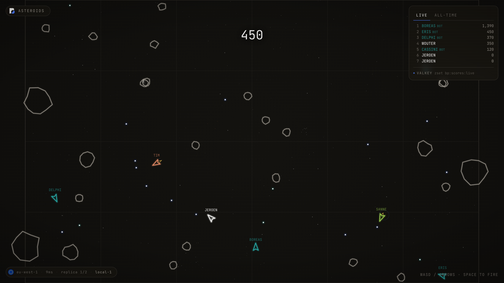
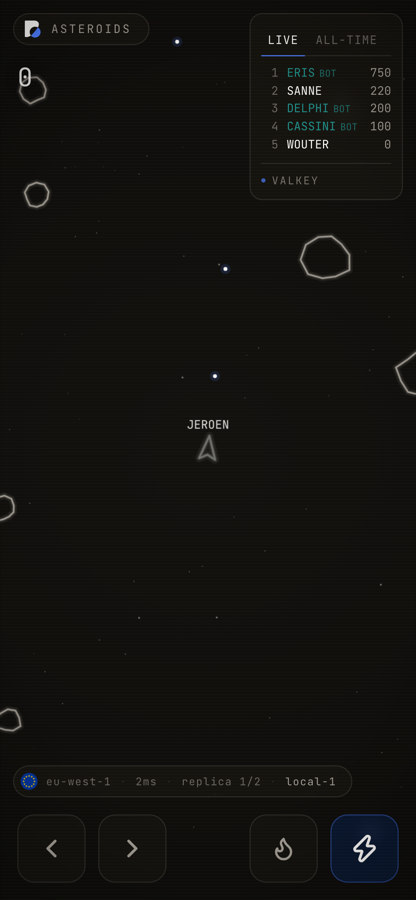
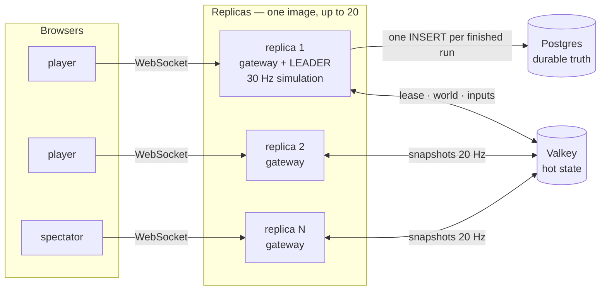
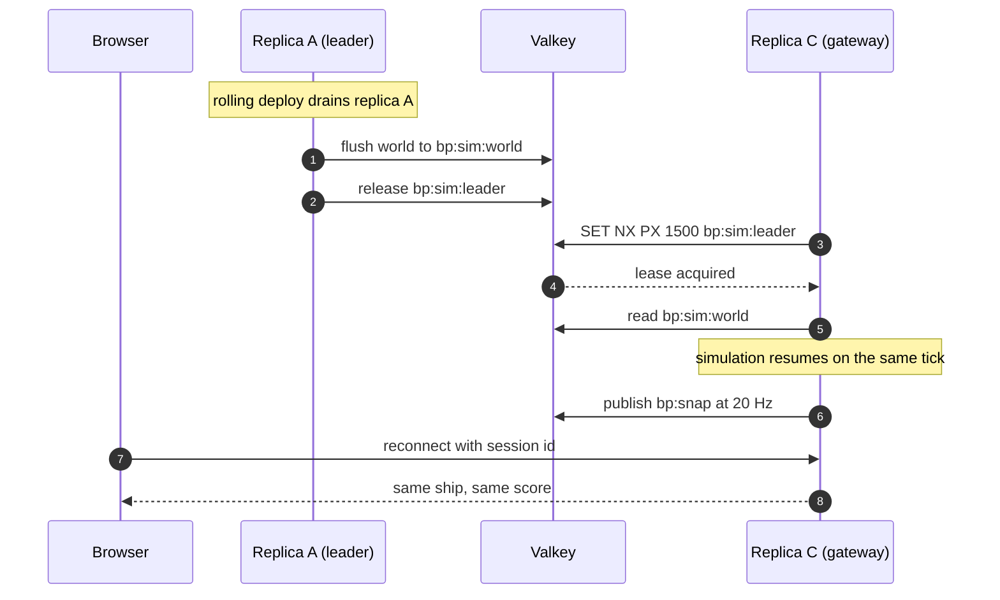

<picture>
  <source media="(prefers-color-scheme: dark)" srcset=".github/brainpod-wordmark.svg">
  
</picture>

# Asteroids

**A public multiplayer Asteroids arena, and a live demo of [Brainpod](https://brainpod.io).**
No signup, no cookie banner — open the link, type a callsign, fly. One Next.js
service, one managed Postgres, one managed Valkey, in `eu-west-1` (Ede, the
Netherlands).

The point of the demo is the part you cannot see: while everyone in the room is
flying, you redeploy the app and nobody's ship stops moving.

## Deploy it yourself

Clone this repository, open your coding agent in it, and paste:

```
Install the Brainpod skill from github.com/brainpodnl/skills and use it to deploy my project to Brainpod.

Sign me up using the Brainpod skills, work out what the project needs, and hand me the live URL when it's up.
```

The skill signs you up, reads the project, works out what it needs, provisions
it, and hands back a live URL.





## What it proves

| Brainpod claim | What demonstrates it |
|---|---|
| **Managed Postgres** | Every finished run writes one `runs` row. Six bots plus a room full of people keep that at ten to twenty inserts a minute unattended, so the database metrics graph is worth opening live. The ALL-TIME board reads straight from it. |
| **Managed Valkey** | The entire multiplayer layer: a lease elects the single authoritative simulation, `bp:snap` fans binary snapshots to every replica at 20 Hz, and the LIVE board is a sorted set. |
| **Up to 20 replicas** | Every replica runs the same image. One wins the lease and simulates; the rest are WebSocket gateways. Scale up mid-call and watch the `replica N of M` badge move. |
| **Zero-downtime deploys** | A draining leader flushes the world to Valkey and releases its lease, so a successor resumes the same tick. Worst measured snapshot gap on a two-replica cluster: **55 ms**, against a 50 ms nominal interval. |
| **EU hosting** | The badge names the region and your RTT. Player names are the only user input, and they never leave `eu-west-1`. |
| **Per-second billing** | A 30 Hz simulation on one small instance, plus gateways that do nothing but fan out bytes. The demo costs what it uses. |

## Architecture



**Hot state lives in Valkey, durable truth lives in Postgres.** Nothing about a
ship in flight is ever written to Postgres, and nothing on the all-time board is
ever served from Valkey.

### Why nobody's ship stops during a deploy



Players attached to the drained replica reconnect in about **half a second**,
keeping their ship and score.
